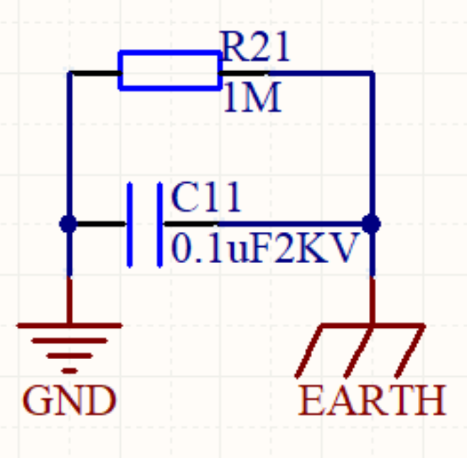
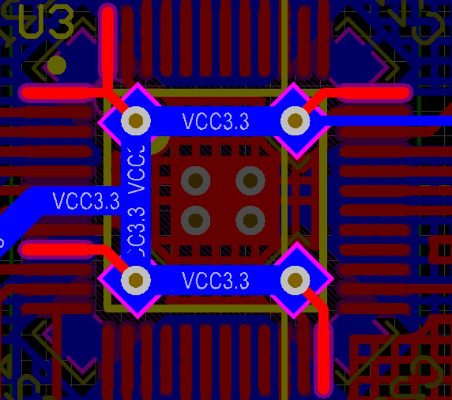

# PCB设计笔记汇总

## 目录
- [PCB设计注意事项](#PCB设计注意事项)
   - [电源](#电源)
    - [布线](#布线)
    - [过孔](#过孔)

## PCB设计注意事项

### 电源

#### 电源滤波电容  
所有的电源芯片都会有滤波电容这一部分，在原理图中通常是与电源芯片并联直接接VCC和GND，但是其行为不应该简单地被理解为与电源芯片滤波，电容引线，VCC先经过电容焊盘，然后再由电容焊盘引到电源芯片，否则这个滤波电容将不会发生作用，至于多个不同大小的滤波电容并联时，电流经过的先后顺序则关系不大。

### 布线

布线应当直来直去，不应出现布线左右乱漂的情况，同时应避免直角走线。

#### 电源布线  
一般而言，电源线使用**50mil**，往元器件分时，使用**30mil**，如果实在走不过去，可降至**20mil**，但是对于现在大部分的MCU来说，封装的引脚宽度大概为**10mil**，此时需要迎合MCU的引脚宽度，当然，这些MCU也不会只有一个供电引脚，可以将这些引脚合并之后再接入电源总线。

#### 信号布线  
信号布线一般使用10mil，**低频信号线**基本就是*连上就行*，对于**高频信号线**，如USB信号线，千兆网线，PCI接口的差分对信号线，应注意阻抗匹配与差分对等长，并且这些线在布线时应拥有更高优先级，在同一层内走完，做好包底外围再处理其他东西。

#### 差分对布线
如USB，RS485等，最好进行对称式布线。

### 过孔

#### 电源线过孔  
对于双层板的电源线，能够不打过孔自然是好的，但是理想很丰满，现实很骨感，有时候受限于成本无法加层，又实在走不过去，没办法就只能打过孔了，但此时建议将过孔直接改为一个通孔焊盘，焊接时就可以直接将其填满锡增强其通过电流的能力。

#### 信号线过孔  
信号线能在同一层走完自然是极好的，但是布线自然是有优先级的，**高频信号线**已经将路都封死的情况下，不打过孔显然是不现实的，或者说，即使不打过孔也得绕远路，此时就该自己斟酌，比如过孔不超过两个，能缩减不小距离，那此时应该打过孔；如果绕远路实际上也远不了多少，那么直接绕路即可。

#### 散热过孔
- 地平面的散热过孔不应该乱打一气，应该等间距打孔，否则容易造成地平面电势差导致元器件工作不稳定。

- 电源芯片的散热过孔也应等间距打孔，并做好顶层和底层铜箔。

### PCB散热

#### 铺铜  
铺铜很重要，但是不应该盲目进行整篇铺铜，更推荐的做法是在有元器件的地方进行网格状铺铜，在PCB空白区可进行整篇铺铜，并打上[散热过孔](#散热过孔)。

### 交流接地
数字地不应直接接到大地(金属外壳)，否则可能会烧坏电源芯片，还可能积累静电打人。正确的做法是通过一个与电容并联的1M以上电阻进行交流接地，如下图：

### 螺丝孔
螺丝孔推荐直接根据螺丝直径放一个通孔焊盘，而非挖槽，因为通孔焊盘自带顶层与底层铺铜，并且带中间层的沉铜，且操作要比挖槽简便得多。

## PCB设计技巧
### MCU旁边的去耦电容
可以参考如下方案：
